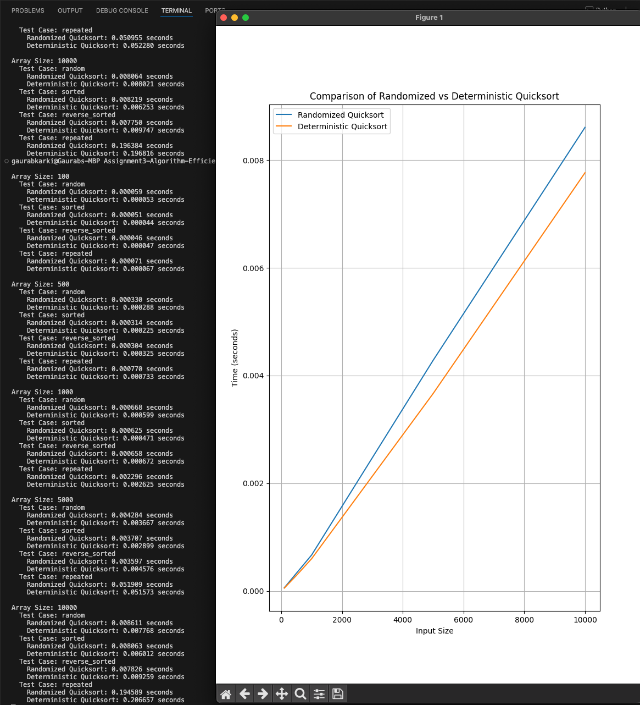
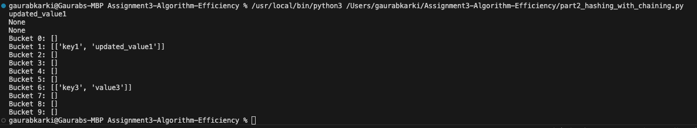

Part 1: Randomized Quicksort Analysis

Theoretical Analysis: 
The average-case time complexity of Randomized Quicksort is O(n log n). It is derived by randomizing the choice of pivot which ensuring the partition are balanced on average. 

1. Recurrence Relation: It partitions the array into two subarrays based on the pivot and sorts them recursively.
The recurrence for the running time is: T(n) = T(k) + T(n-k-1) + O(n), where 
k=size of the partition,
n-k-1= size of second partition, 
O(n)= number of partition.

2. Indicator Random Variables: It compares two elements only if one is chosen as pibot before they are divided into different subarrays. 
Lets say,
We have two elements Xij where Xij=1 if a[i] and a[j] are compared, then the probability will be 1/(j-i+1) thus inner sum will be O(n log n)

Empirical Comparisons:
Randomized Quicksort and Deterministic Quickshot pivot the first element.

Results: 

1. Randomly Generated Arrays: Both algorithm perform efficiently (O(n log n))
2. Already Sorted Arrays: Deterministic Qucksort performs weak due to unbalance partition which results to O(n^2) complexity, where as Randomized Quicksort maintains (O(n log n))
3. Reverse-sorted Arrays: Deterministic Qucksort results to O(n^2) complexity, while Randomized Quicksort maintains (O(n log n))
4. Arrays with Repeated Elements: Both algorithm handles repeated elements well.

Randomized Quicksort consistently performs well for sorted and reverse-sorted arrays.

Part 2: Hashing with Chaining

Hasing with Chaining is a great technique for resolving collisions in a hash table. The expected time complexity for insert, search and delete operatatio is O(1+α), where
α(Load Factor) = Number of elements\ Number of slots

Load Factor:
The load factor α is low (α<1), when the chain length in each bucket is small and the operation like insert, search and delete takes O(1) complexity.
As the load factor increases, chain in the bucket grows leading to bad complexity. 
For instance: If α becomes very large, operations can degrade towards O(n) complexity.

Strategies for maintaining a low load facro and minizming Ccollisions:
1. Dynamic Resizing: When α exceeds a threshold (0.75), the hash table is resized in double, and all the elements in the bucket are rehashed into the new table whing keeps the load facor low.
2. Prime Table Sizes: Choosing the number of slots as a prime number reduces clustering and improves the distribution.

